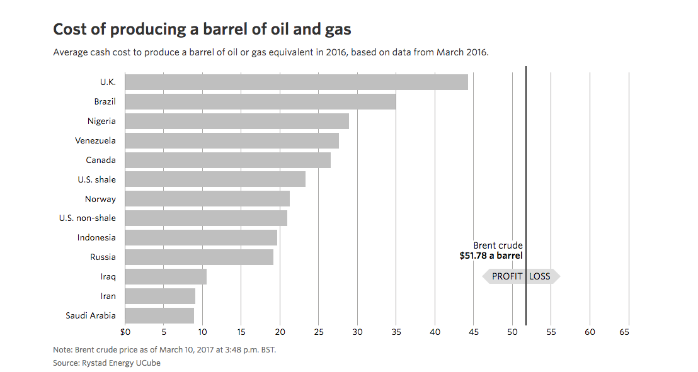

# Alberta Oil is the Tar Sands Again

## Summary

Posit: 
* renewable energy is becoming economically competitive -- and superior to -- fossil fuels.  
* demand for oil is in secular decline
* the Alberta Tar Sands will get hit first/early and hard/hardest

## Why Target the Tar Sands? 

Tar sands oil is too expensive to produce relative to other options.  Oil from Northern Alberta is among the most costly to produce on earth, according to [Wall Street Journal][WSJ]:

> Most production growth in Canada comes from oil sands deposits in the remote boreal forests of northern Alberta, which have some of the industry's highest capital costs and longest development timelines.

As the [WSJ][WSJ] piece details, the overall costs are not due to taxes or administration (which disproportionately burden other oil producers), but the raw extraction and processing costs (which cannot be fudged).

Tar sands oil is heavy and bitter.  MidEast oil is light and sweet.  The former costs more to get to market than the latter.

Putting aside the moral question of whether pumping and burning fossil fuels is ok, how can we reconcile the desire for cheap energy, thus low cost goods and services, with the need for a healthy planet? 

> "Policy is hurting the Canadian oil industry" 

Is a fabrication created by the Canadian oil industry, per cost breakdown from [WSJ][WSJ].   

Because of this, Canadian crude trades at a substantial discount to other North American grades due to its low quality and limited pipeline access to market.  

Compared to global oil-producing peers, Canada is huge laggard.  Is it plausible that Canadian oil producers will ever be able to compete?  My guess is no. 

How does Canada make oil production profitable under these competitive pressures?  Commodities are well known to trend towards depreciation, rather than depreciation. 

## Solar Is Coming ... so is Nuclear

It is far more likely that the status quo changes dramatically in the energy industry than stasis.  The future does not look like the past in global energy markets.

### Nuclear

Largest barrier to more nuclear power is human error.  The misconception that nuclear can be bad, harmful, dangerous, but so are all other forms of energy.  When grading on a curve.  Engineers know what the public doesn't: there is plenty of potential for safe, clean, and sustainable nuclear. Lets invest here, rather than oil.  https://www.youtube.com/watch?v=LZXUR4z2P9w

### Solar 

Watch Standford professor Tony Seba on future of energy. This talk, titled "Clean Disruption - Why Energy & Transportation will be Obsolete by 2030 - Oslo, March 2016" https://www.youtube.com/watch?v=Kxryv2XrnqM

Seba asserts that four technology categories will disrupt energy and transportation by:
1. Batteries / Energy Storage
2. Electric Vehicles
3. Self-Driving Vehicles
4. Solar Energy

The outcome of the Clean Disruption is that by 2030 
* All new vehicles will be electric.
* All new vehicles will be autonomous (self-driving).
* Oil will be obsolete
* Coal, natural gas and nuclear will be obsolete
* 80+ per cent of parking spaces will be obsolete.
* Individual car ownership will be obsolete.
* All new energy will be provided by solar (and wind)

> Clean Disruption is a technology disruption. 

Just like digital cameras disrupted film and the web disrupted publishing, Clean Disruption is inevitable and it will be swift. 

This is not a wonk radical spewing non-sense, this talk is backed by real trends in electrical engineering, materials and computer science.  Solar is now economical without subsidies and within 5-10 years will be adequate for regions with modest sunlight.

## Policy Questions for Canada

1. how should governments respond to economic stress
2. is Canadian oil economical? 
3. how soon until oil is obsolete?

My goal is to help the people of Alberta, and anyone negatively impacted by lower prices have a prosperous future.  Some working in the oil industry have lost their jobs, and no one wants to see layoffs and headcount reductions.

### Case Study: Steel in the Hammer

Growing up in Hamilton, Ontario gave me a front-row seat to the role of government aid in struggling businesses and communities.  Once a booming steel town, Hamilton is trapped in a sink hole created by non-competitive industry.  The anchor is harmful government intervention that prevents the market from clearing and the region move on.

Government intervention in mature industries does not work, is as-near to a complete waste of time and money as there is.

## Protectionism: Buy Canada doesn't work. 

Most if, not 100%, of the food, clothing and home furniture we buy is not made in Canada?  Global trade is here to stay (because it is such a fabulous enabler of prosperity).  If you support protectionist measure to support/bailout the Cdn oil sector, then you're support higher prices for the goods and services that all Canadians consume. 

We don't need to double the math on this: higher oil prices is a net positive for all Canadians, because we're all households consume energy. 

## Will Oil Become Obsolete?

Crude oil consumption in Canada has plateaued for a decade... http://www.indexmundi.com/energy/?country=ca&product=oil&graph=consumption

Fun thought experiment: how much should one save to protect their lifestyle in troubled times?  How should we view people who fall on hard times following a massive boom period?  Should these people and companies not be more equipped for the bust?  Fat to survive the winter?

Support robust and easy to use EI.  You know what we used to call that: SAVINGS.  Of course, Canadians aren't saving, in fact they're broke!  Savings rates below 5% since 1995: http://cdn.tradingeconomics.com/embed/?s=canadapersav&v=201610011445o&d1=19160101&d2=20161231&h=300&w=600%27%20height=%27300%27%20width=%27600

We live on debt, in so doing the risks of job loss are magnified.  Total private credit has grown ~4x since 1998...  this chart is stagerring http://cdn.tradingeconomics.com/embed/?s=canadapriseccre&v=201610121318o&d1=19160101&d2=20161231&h=300&w=600' height='300' width='600

"There are 1.3 billion people in China that want to have the same quality of life that you and I have."

Fine, but there life will be different because it taking place in the future, not the past.

To assume their energy consumption will have a similar distribution to recent history is a farce.  You are drawing cartoon lines, and telling lies with data.

[WSJ]:http://graphics.wsj.com/oil-barrel-breakdown/